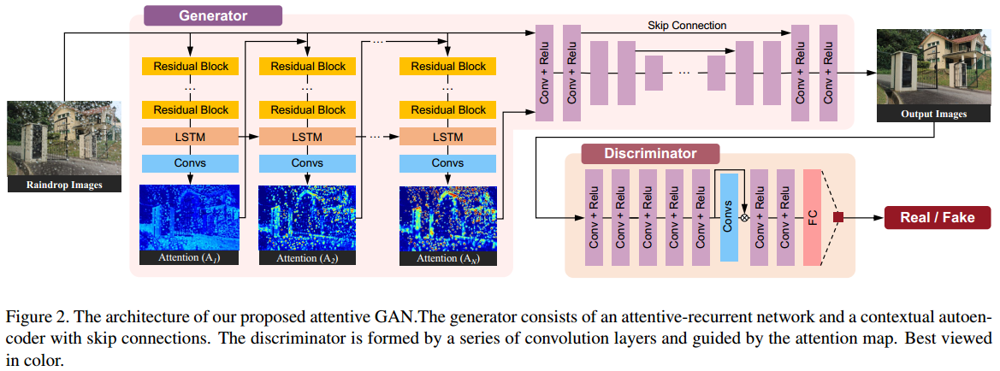
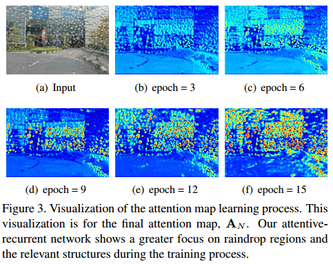
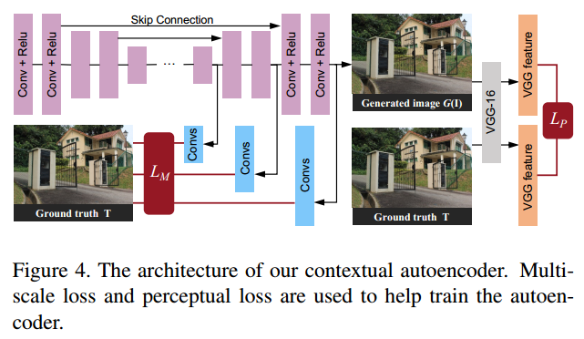
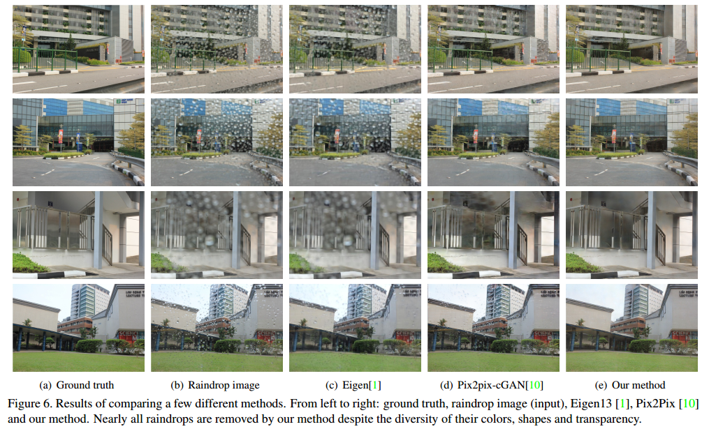

# Attentive Generative Adversarial Network for Raindrop Removal from A Single Image

> - Rui Qian1, Robby T. Tan2;3∗ , Wenhan Yang1, Jiajun Su1, and Jiaying Liu
> - [**CVPR 2018**]、[[pdf](https://arxiv.org/pdf/1711.10098.pdf)]、[[code](https://github.com/rui1996/DeRaindrop)]

## 1. Introduction

**Challenge**: The raindrop-removal problem is intractable.

1. The regions which are occluded by raindrops are not given.
2. The information about the background scene of the occluded regions is completely lost for most part.
3. The problem gets worse when the raindrops are relatively large and distributed densely across the input image. 

Generative network first attempts to produce an attention map by ResNets & convolutional LSTM.
The second part of our generative network is an autoencoder.

**Contribution**: 

1. Introduce a novel method of raindrop removal.
2. Inject the attention map into both generative and discriminative networks, which is novel and works effectively in removing raindrops.

## 2. Related Work

- learns the shape of raindrops using PCA, and attempts to match a region in the test image,
  with those of the learned raindrops. 
- proposes a method that compares a synthetically generated raindrop with a patch that potentially has a raindrop. 
- uses a stereo system to detect and remove raindrops 
- Pix2Pix 

## 3. Raindrop Image Formation

**raindrop degraded image model**
$$
I = (1-M) \odot B + R
$$
> $I$: colored input image;
> $M$: the binary mask, In the mask, $M(x) = 1$ means the pixel $x$ is part of a raindrop region, and otherwise means it is part of background regions. 
> $B$: background image; 
> $R$: the effect brought by the raindrops;
> $\odot$: element-wise multiplication, 数组元素依次相乘

**Goal**: to obtain the background image $B​$ from a given input $I​$. 

## 4. Raindrop Removal using Attentive GAN

**architecture of proposed network**

**generative adversarial loss**
$$
\min_G\max_D \mathbb{E}_{R\sim p_{clean}}[\log(D(R))] + \mathbb{E}_{I\sim p_{raindrop}}[\log(1-D(G(I)))]
$$
> $G$: generative network;
> $D$: discriminative network;
> $I$: a sample drawn from our pool of images degraded by raindrops, which is the input of our generative network.
> $R$: a sample from a pool of clean natural images.

### 4.1. Generative Network

Generative network包含两个子网络: an **attentive-recurrent network** and a **contextual autoencoder**. 

#### 第一部分：Attentive-Recurrent Network

The purpose of the attentive recurrent network is to find regions in the input image that need to get attention（用于生成attention map）. These regions are mainly the raindrop regions.

**输入**：为有雨滴图像

**输出**：为attention map

**网络结构**：每一个time step（即fig2中左边2、3、4列）包含5个ResNet层（用于从输入图像和之前的block输出提取特征）、1个convolutional LSTM unit、1个卷积层（用于生成2D的attention maps ）。
其中convolution LSTM unit 包含 an **input gate** $i_t$, a **forget gate** $f_t$, an **output gate** $o_t$ as well as a **cell state** $C_t$. 
$$
\begin{split}
&i_t = \sigma(W_{xi}*X_t+W_{hi}*H_{t-1}+W_{ci}\odot C_{t-1}+b_i) \\
&f_t = \sigma(W_{xf}*X_t+W_{hf}*H_{t-1}+W_{cf}\odot C_{t-1}+b_f) \\
&C_t = f_t \odot C_{t-1} + i_t \odot \tanh(W_{xc}*X_t + W_{hc}*H_{t-1}+b_c) \\
&o_t = \sigma(W_{xo}*X_t+W_{ho}*H_{t-1}+W_{co}\odot C_t+b_o) \\
&H_t = o_t \odot \tanh(C_t)
\end{split}
$$

> $X_t$: the features generated by ResNet
> $C_t$: encodes the cell state that will be fed to the next LSTM
> $H_t$: the output features of the LSTM unit
> $*$: the convolution operation

**loss function**：每一个recurrent block的loss function定义为$A_t​$和$M​$之间的mean squared error(MSE)，$A_t​$为$t​$ time step输出的attention map，$M​$为binary mask。对于$N​$个time steps，loss function的表达式为：
$$
\mathcal{L}_{ATT}(\{A\}, M) = \sum_{t=1}^N \theta ^{N-t} \mathcal{L}_{MSE}(A_t, M)
$$
其中$A_t=ATT_t(F_{t-1}, H_{t-1}, C_{t-1})$，函数$ATT_t$表示 $t$ time step的attentive-recurrent network，$F_{t-1}$表示input image和上一个step的attention map的concatenation(串联)，初始时attention map的值全为0.5。实验中作者将$N$设为4，将$\theta$设为0.8。attention map在不同time step的可视化结果：

#### 第二部分：Contextual Autoencoder

The purpose of our contextual autoencoder is to generate an image that is free from raindrops.  该部分网络用于生成无雨滴的图像。

**输入**：input image和final attention map的concatenation（串联）。

**输出**：无雨滴的图像。

**网络结构**：

**loss function**：分为两部分，<u>multi-scale loss</u>和<u>perceptual loss</u>。
<u>multi-scale loss</u>，捕捉更多不同尺度的contextual information (上下文信息)。表达式为：
$$
\mathcal{L}_M(\{S\}, \{T\})=\sum_{i=1}^M \lambda_i\mathcal{L}_{MSE}(S_i, T_i)
$$

> $S_i$ 为从decoder层中提取的第i个输出
> $T_i$ 为 $S_i$对应的同尺度的ground truth。
> $\lambda_i$ 为不同scale的超参数

作者使用了$1^{st}, 3^{rd}, 5^{th}$层，分别是原尺寸的1/4，1/2，1倍，对应的$\lambda$分别设置为0.6，0.8，1.0。
<u>perceptual loss</u>，用于衡量output和ground truth的特征的全局差异。表达式为：
$$
\mathcal{L}_P(O, T)=\mathcal{L}_{MSE}(VGG(O), VGG(T))
$$

> $O$ ：output image
> $T$ ：ground truth image
> $VGG$ ：函数，为在ImageNet上预训练的VGG16

总的generative loss为：
$$
\mathcal{L}_G = 10^{-2}\mathcal{L}_{GAN}(O)+\mathcal{L}_{ATT}(\{A\}, M)+\mathcal{L}_M(\{S\},\{T\})+\mathcal{L}_P(O, T)
$$
其中$\mathcal{L}_{GAN}(O)=\log(1-D(O))$。

### 4.2. Discriminative Network

Discriminative 部分采用global and local image-content consistency。**global discriminator**着眼于图像全局的一致性，**local discriminator**着眼于小的特定区域。

**whole loss function of the discriminator**：
$$
\mathcal{L}_D(O,R,A_N)=-\log(D(R))-\log(1-D(O))+\gamma\mathcal{L}_{map}(O,R,A_N)
$$
其中$\mathcal{L}_{map}$是从discriminator中间层提取的特征与final attention map之间的loss：
$$
\mathcal{L}_{map}(O,R,A_N)=\mathcal{L}_{MSE}(D_{map}(O),A_N)+\mathcal{L}_{MSE}(D_{map}(R), 0)
$$
$D_{map}$表示the process of producing a 2D map by the discriminative network，$\gamma$ 设为0.05，$R$是从真实和干净的图像池中提取的样本图像。$0$ 为全0的map。

## 5. Raindrop Dataset

数据集为作者自己采集，1119组有雨滴-无雨滴的pair，有雨滴图像通过在相机前放置喷有水滴的玻璃获得，无雨滴图像通过在相机前放置同样的干净的玻璃获得。

## 6. Experimental Results

- **Quantitative Evaluation 定量分析**：使用**PSNR**（峰值信噪比）和**SSIM**（结构相似性，是一种衡量两幅图像相似度的指标）指标。
- **Qualitative Evaluation 定性分析**：
- **Application 应用**
## 7. Conclusion

​	