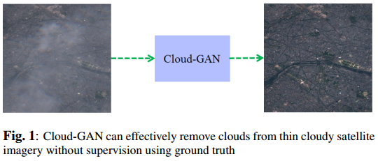

# Cloud-GAN: Cloud Removal for Sentinel-2 Imagery using a Cyclic Consistent Generative Adversarial Networks

> - Praveer Singh and Nikos Komodakis, Ecole des Ponts ParisTech & Universit ´ e Paris Est, France
> - **IGARSS 2018**
> - [pdf](https://ieeexplore.ieee.org/stamp/stamp.jsp?arnumber=8519033&tag=1)

[TOC]

## 1. Introduction

传统算法性能有限

McGANs：模拟云与真实云之间存在差距

**cloud-GAN**:

- if an image is transformed from input domain to target and then back to the input domain, it should look alike to the original image. 
- Doesn’t require explicit paired cloudy/cloud-free dataset.
- Doesn’t require cloud-penetration sources of imagery such as SAR or NIR.

**framework**:

## 2. Proposed Framework and Methodlogy

## 3. Training and Implementation details

### 3.1 Dataset

High resolution Level-1C Sentinel-2 imagery ranging between the year 2015 till 2017. Choose Blue (B2), Green (B3), Red (B4) all of which have 10 meters of spatial resolution.

Extract 512 × 512 patches from 20 cloudy and 13 cloudless images, 1677 patches for each cloud and cloud-free dataset for training and 837 patches for testing. For computational efficiency in training, resize to 256 × 256.

### 3.2 Network Architectures

**Generator architecture**: uses 6 blocks for 128 × 128 training images and 9 blocks for 256 × 256 or higher resolution images, a reflection pad is imbibed to avoid artifacts.

**Discriminator architecture**: consists of a 70 × 70 PatchGAN, classifying 70 × 70 patches as real or fake data. 

### 3.3 Training

- **Initialization**: Gaussian distribution with mean 0 and standard deviation 0.02
- **Optimization**: ADAM
- **batch size**: 1
- λ = 10
- using a **learning rate** of 0.0002 up-to 200 **epochs**, The learning rate was kept constant for the first 100 epochs after which it linearly decays to zero until the last epoch. 

## 4. Results and Discussions

**Result on real cloud**:

**Result on synthetic cloud**:

**PSNR(**Peak Signal to Noise Ratio, 峰值信噪比**) results on synthetic cloud**: 

## 5. Conclusions

