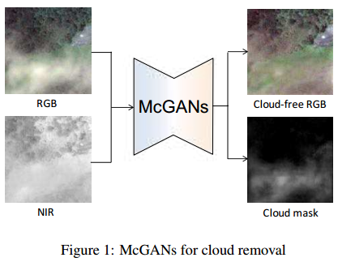
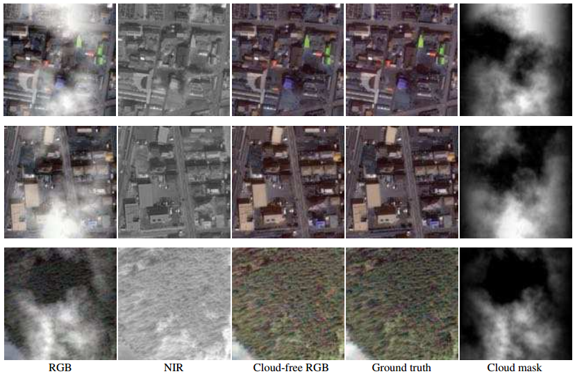
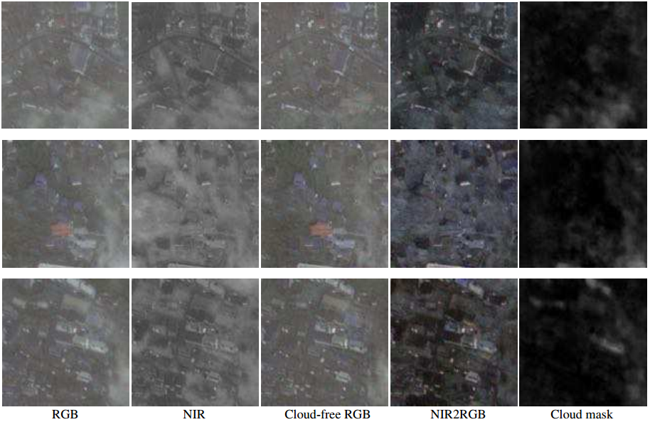

# Filmy Cloud Removal on Satellite Imagery with Multispectral Conditional Generative Adversarial Nets 

利用多光谱条件生成对抗网络(McGAN)对卫星影像进行薄云去除

> - Kenji Enomoto, Ken Sakurada, Weimin Wang, Hiroshi Fukui, Masashi Matsuoka,
>   Ryosuke Nakamura, Nobuo Kawaguchi
> - **CVPR workshop 2017**
> - [pdf](https://arxiv.org/abs/1710.04835)
> - [code](https://github.com/enomotokenji/mcgan-cvprw2017-pytorch)

[TOC]

## 1. Introduction

## 2. Related Work

## 3. Dataset Generation for Cloud Removal 

用于云去除的数据集生成

### 3.1 Synthesis of cloud-obscured images 

云覆盖图像的合成

1. Simulated cloud using **Perlin noise**.(使用Perlin噪声的模拟云)

2. Merged image with the cloud by **alpha blending**.(通过alpha混合将图像与云合并) 

   > **alpha blending**：是按照“Alpha”混合向量的值来混合源像素和目标像素的一种图像处理技术。Alpha混合向量一般表示了图片的透明度。

3. **Color correction**.(色彩校正)

### 3.2 Uniformization of the dataset with t-SNE 

使用t-SNE均匀化数据集

大致意思是为了降低网络对图像地物类别的敏感性。

## 4. Multispectral conditional Generative Adversarial Networks (McGANs) 

### input
four channels RGB-NIR images (NIR: near-infrared band)

### output
the predicted RGB image after cloud removal  & the predicted RGB image after cloud removal 

### Network Architecture

#### 生成器结构

#### McGANs网络结构

|      C      |          B          |     R      |    D    |       ()内数字       |
| :---------: | :-----------------: | :--------: | :-----: | :------------------: |
| Convolution | Batch Normalization | Leaky ReLU | Dropout | number, size, stride |

#### 目标函数

分为cGAN目标函数和L1损失函数。总体如下。

$$
G^*=\arg{\min_G{\max_D{\mathcal{L}_{cGAN}(G,D)}}}+\mathcal{L}_{L1}(G)
$$

其中，cGAN的目标函数如下。

$$
\mathcal{L}_{cGAN}(C,D)=\mathbb{E}_{x,y\sim p_{data}(x,y)}[\log{D(x,y)}]+\mathbb{E}_{x\sim p_{data}(x),z\sim p_{z}(z)}[\log(1-D(x,G(x,z)))]
$$

L1 loss function of the Generator如下 。$I_M$ 为多光谱输入图像，$I_T$ 为4通道输出图像，$\lambda_c$ 为各通道对loss的权重，在该论文中均设置为1，$\phi(I_M)$ 表示网络的预测结果。

$$
\mathcal{L}_{L1}(G)=\frac{1}{4HW}\sum_{c=1}^{4}\sum_{v=1}^{H}\sum_{u=1}^{W}\lambda_c |I_T^{(u,v,c)}-\phi(I_M)^{(u,v,c)}|_1
$$

## 5. Evaluation Results 

**NIR-cGANs**: 训练集仅以NIR图像作为cGANs的输入。

### McGANs在合成云图像上的预测结果

从左到右依次为合成云图像，NIR图像，McGANs去云后的图像，真实图像，云图像。

### McGANs在真实云图像上的预测结果

从左到右依次为合成云图像，NIR图像，McGANs去云后的图像，NIR-cGANs去云后的图像，云图像。

## 6. Conclusion 

- 提出McGANs来去除卫星影像中的薄云
- 训练网络的数据集是通过在没有云的图像上合成具有Perlin噪声的模拟云来构建的
- 为了避免因数据集偏差而使在某些类别上过拟合，引入t-SNE以在每个类别中均匀地采样
- the experimental results evaluated on the constructed data prove that the clouds in the visible light images can be removed if they are penetrated in NIR images. 

---

## My Note

- 模拟云和真实云存在差异，该论文所做的cloud removal，更像是Perlin noise removal。
- 网络训练时，RGB图像有云，NIR图像无云，感觉设计不合理。
- 该论文在真实云上的结果不好，肉眼看几乎没区别。
- 该论文没有定量分析，也没有与其他方法对比，对算法的性能评估缺乏可靠支撑。

