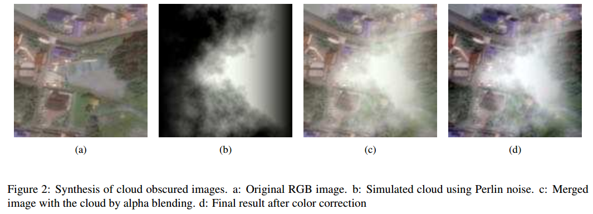
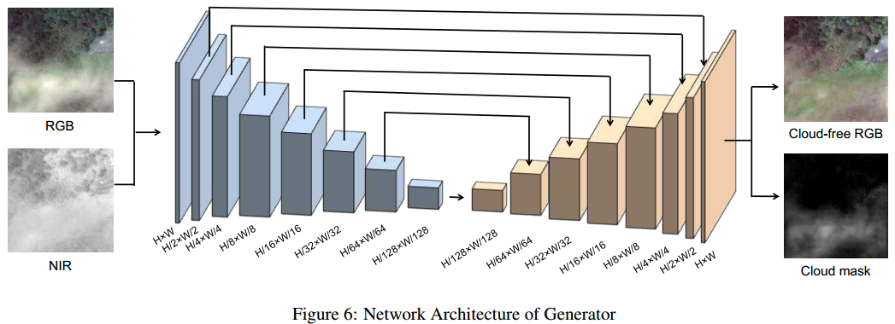
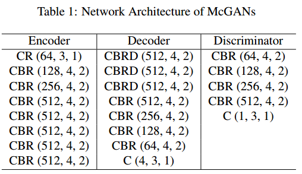
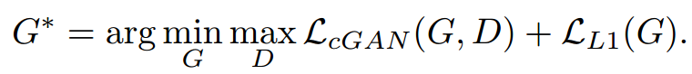
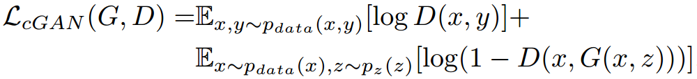
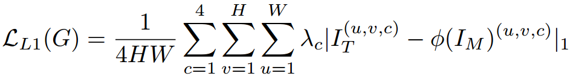

# Filmy Cloud Removal on Satellite Imagery with Multispectral Conditional Generative Adversarial Nets 

利用多光谱条件生成对抗网络(McGAN)对卫星影像进行薄云去除

> - Kenji Enomoto, Ken Sakurada, Weimin Wang, Hiroshi Fukui, Masashi Matsuoka,
>   Ryosuke Nakamura, Nobuo Kawaguchi
> - **CVPR workshop 2017**
> - [pdf](https://arxiv.org/abs/1710.04835)
> - [code](https://github.com/enomotokenji/mcgan-cvprw2017-pytorch)

[TOC]

## 1. Introduction

## 2. Related Work

## 3. Dataset Generation for Cloud Removal 

用于云去除的数据集生成

### 3.1 Synthesis of cloud-obscured images 

云覆盖图像的合成

1. Simulated cloud using **Perlin noise**.(使用Perlin噪声的模拟云)

2. Merged image with the cloud by **alpha blending**.(通过alpha混合将图像与云合并) 

   > **alpha blending**：是按照“Alpha”混合向量的值来混合源像素和目标像素的一种图像处理技术。Alpha混合向量一般表示了图片的透明度。

3. **Color correction**.(色彩校正)

### 3.2 Uniformization of the dataset with t-SNE 

使用t-SNE统一数据集

## 4. Multispectral conditional Generative Adversarial Networks (McGANs) 

- **input**: four channels RGB-NIR images (NIR: near-infrared band)

- **output**: the predicted RGB image after cloud removal  & the predicted RGB image after cloud removal 

- **Network Architecture **: 
  - 生成器结构

    

  - McGANs网络结构

    

    |      C      |          B          |     R      |    D    |       ()内数字       |
    | :---------: | :-----------------: | :--------: | :-----: | :------------------: |
    | Convolution | Batch Normalization | Leaky ReLU | Dropout | number, size, stride |

  - objective function

    

    其中，cGAN的目标函数如下。

    

    L1 loss function of the Generator 。$x^2$

    

## 5. Evaluation Results 

## 6. Conclusion 

